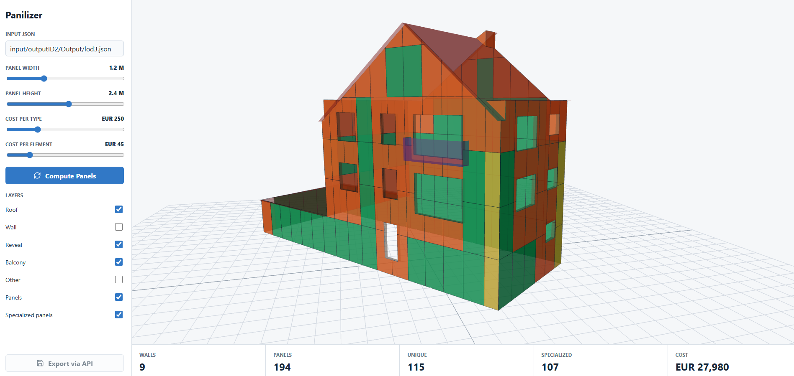

# Panilizer

Panilizer parses LoD3 CityJSON buildings and generates facade panel layouts. It separates semantic building parts, covers wall surfaces with configurable panels, clips specialized panels around facade boundaries/openings, and estimates panelization cost.



## What It Does

- Parses LoD3 CityJSON building geometry.
- Keeps semantic parts such as walls, roofs, balconies, windows, doors, and reveals separate.
- Generates standard and specialized wall panels from panel width/height settings.
- Clips specialized panels to wall outlines and openings so they do not protrude.
- Exports panel JSON for downstream workflows.
- Provides a local API/UI and a static GitHub Pages demo.

## Interactive Demo

This repository includes a static Three.js demo in `docs/`. It shows the original building and the generated panel layout with rotatable 3D controls and layer toggles.

To view it locally:

```powershell
python -m http.server 8080 -d docs
```

Then open:

```text
http://127.0.0.1:8080
```

For GitHub Pages, set the Pages source to:

```text
Branch: main
Folder: /docs
```

## Structure

- `main.py` - CLI entry point for batch panel JSON generation.
- `config/` - panelizer settings.
- `docs/` - static GitHub Pages demo with precomputed geometry.
- `input/` - source CityJSON/building data.
- `output/` - generated panel JSON files.
- `pics/` - README and documentation images.
- `src/building_parser.py` - CityJSON LoD3 parser.
- `src/panelizer.py` - wall panel generation.
- `src/service.py` - shared backend/CLI orchestration.
- `src/api.py` and `src/api_models.py` - FastAPI backend.
- `ui/` - React + Three.js partner demo interface.

## Python Setup

```powershell
python -m venv .venv
.venv\Scripts\activate
pip install -r requirements.txt
```

If `uvicorn`, `open3d`, or other Python packages are not found, make sure the virtual environment is active and run `pip install -r requirements.txt` again.

## Batch Run

The default example uses `input/outputID2/Output/lod3.json` and writes `output/2_panels.json`.

```powershell
python main.py --config config/panelizer_config.json
```

Main panel settings live in `config/panelizer_config.json`:

- `panel_width`
- `panel_height`
- `cost_per_unique_panel_type`
- `cost_per_panel_element`

Geometry tolerances and numeric precision are internal defaults in `src/panelizer.py`.

## Backend API

Start the backend from the repository root:

```powershell
uvicorn src.api:app --reload
```

By default this runs at `http://127.0.0.1:8000`.

Routes:

- `GET /health`
- `GET /config`
- `POST /buildings`
- `POST /panelize`
- `POST /panelize/export`

## Demo UI

The UI needs Node.js/npm. If PowerShell says `npm` is not recognized, install the Node.js LTS version from `https://nodejs.org/`, then close and reopen VS Code or PowerShell.

Check the install:

```powershell
node --version
npm --version
```

Start the UI in a second terminal while the backend is still running:

```powershell
cd ui
npm install
npm run dev
```

Open the Vite URL printed in the terminal, usually `http://127.0.0.1:5173`.

The UI expects the backend at `http://127.0.0.1:8000`. To change that, create `ui/.env` based on `ui/.env.example`:

```powershell
VITE_API_BASE=http://127.0.0.1:8000
```

## Typical Development Flow

Use two terminals:

```powershell
# Terminal 1: backend
.\scripts\start_backend.ps1
```

```powershell
# Terminal 2: frontend
.\scripts\start_ui.ps1
```

After a reboot, start both again. If the UI shows `Failed to fetch`, the backend at `http://127.0.0.1:8000` is usually not running. Check it with:

```powershell
Invoke-WebRequest http://127.0.0.1:8000/health
```
